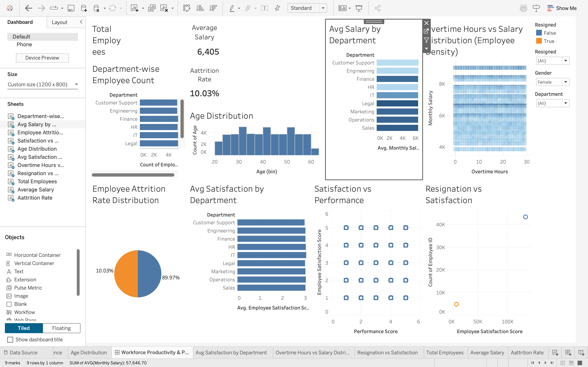

# Workforce Productivity and Organizational Performance Dashboard

## 📊 Dashboard Preview

## 📊 Project Overview

This project analyzes employee performance, productivity, and attrition using Tableau and MySQL. The dashboard provides insights into workforce distribution, salary patterns, employee satisfaction, and attrition trends.

## 🛠 Tools Used

* Tableau (Visualization)
* MySQL (Data Management)
* CSV Dataset

## 📈 Key Features

* Department-wise employee analysis
* Salary distribution insights
* Attrition rate analysis
* Employee satisfaction vs performance
* Overtime vs salary heatmap

## 📌 Insights

* Salary is distributed in fixed bands across departments
* Attrition rate is around 10%
* No strong correlation between overtime and salary
* Employee satisfaction does not strongly impact performance

## 📂 Files Included

* Tableau Dashboard (.twbx)
* Dataset (.csv)

## 🚀 How to Use

1. Download the `.twbx` file
2. Open using Tableau Desktop / Tableau Public
3. Explore dashboard using filters

## 🚀 Author

Gokul
